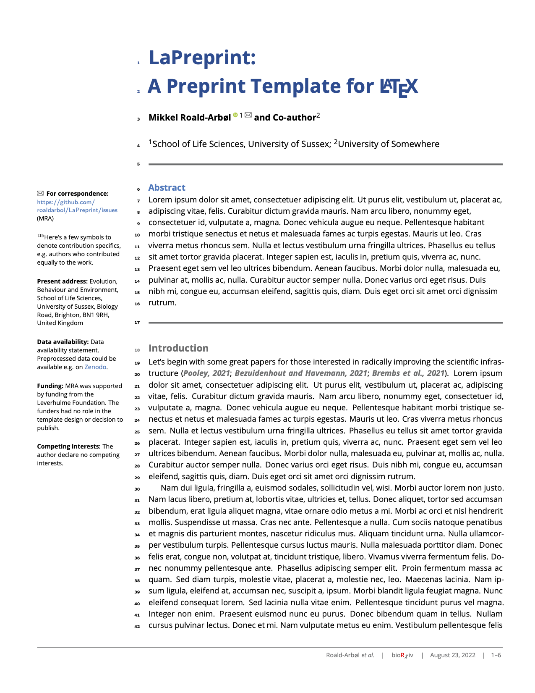

# LaPreprint

- Author: Mikkel Roald-Arbøl
- Website: https://github.com/roaldarbol/LaPreprint
- License: MIT



## Usage

Install [MyST Markdown](https://myst-tools.org/docs/mystjs/quickstart), and then add some frontmatter:

```yaml
---
exports:
  - format: pdf
    template: lapreprint
    venue_footer: arxiv
    theme_color: red
---
```

For all options use:

```bash
myst templates list lapreprint --tex
```

To build your PDF:

```bash
myst build --pdf
```

See [MyST Guide for creating Documents](https://myst-tools.org/docs/mystjs/quickstart-myst-documents) for full instructions.
